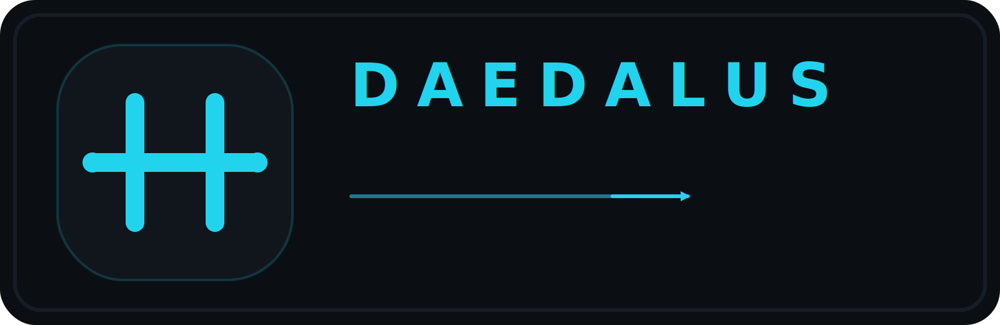

<div align="center">



**A durable orchestration runtime for long-running agent workflows.**

*Daedalus the craftsman built the Labyrinth, gave Theseus the thread, and warned Icarus not to fly too close to the sun. This Daedalus does the agent-orchestration version of all three.*

</div>

---

## What it is

Daedalus is the runtime layer underneath agentic SDLC automation. It is **not** the policy brain — your workflow wrapper still decides *what* to do next. Daedalus owns the boring, fragile parts that make 24/7 operation actually work:

- **The thread** — leases and heartbeats so a single owner is always responsible for a lane
- **The labyrinth** — explicit workflow state in SQLite (current truth) and JSONL (append-only history), not scattered prompt context
- **The wings** — hot-reloadable config, per-tick preflight, stall detection, and a status surface that lets you see what the swarm is doing without restarting it

> Turn fragile cron-loop automation into explicit, durable, role-based 24/7 workflow orchestration.

## Why it exists

Classic agent automation breaks for the same reasons every time:

- policy buried in prompts or cron jobs
- state spread across files, GitHub, and half-finished sessions
- actions inferred, not queued
- failures logged but not modeled
- retries accidental instead of explicit
- coder ↔ reviewer ↔ merge handoffs implicit and brittle

Fine for demos. Fatal for a lane that's supposed to ship code while you sleep.

Daedalus replaces that with: a durable runtime, explicit actions and actors, canonical current state, append-only event history, shadow ↔ active execution modes, and supervised long-running process ownership.

## Capabilities at a glance

| | |
|---|---|
| **Durable state** | SQLite lanes table is canonical truth; JSONL events are append-only history |
| **Leases & heartbeats** | One owner per lane; expired leases auto-recovered, no split-brain |
| **Shadow → active** | Promote from observation to execution behind an explicit gate |
| **Hot-reload** | `workflow.yaml` edits picked up per-tick; bad reloads keep the last known good config alive (Symphony §6.2) |
| **Per-tick preflight** | Bad config skips dispatch but reconciliation keeps running — never crash the loop (Symphony §6.3) |
| **Stall detection** | `Runtime.last_activity_ts()` + `stall.timeout_ms` terminates wedged workers and queues a retry (Symphony §8.5) |
| **Symphony event taxonomy** | First-class `daedalus.*` event namespace with a one-release legacy alias window (§10.4) |
| **HTTP status surface** | Optional localhost JSON+HTML for `running`, `retrying`, `totals`, recent events (§13.7) |
| **Multiple runtimes** | One-shot `claude-cli`, persistent-session `acpx-codex`, and one-shot `hermes-agent` adapters |
| **Operator commands** | `/daedalus status`, `shadow-report`, `doctor`, `active-gate-status`, `iterate-active` |

## Repo layout

The top-level `.py` files are intentionally flat: this directory is a **Hermes plugin payload** that gets copied verbatim into `~/.hermes/plugins/daedalus/`, and the loader puts that directory on `sys.path` so the modules import each other by bare name. Don't restructure it without also rewriting the import bootstrap in `__init__.py`.

```
.
├── __init__.py                  Plugin registration; sys.path bootstrap
├── plugin.yaml                  Plugin manifest
├── runtime.py                   Canonical Daedalus runtime — leases, state, events
├── tools.py                     Operator surface, systemd helpers, slash dispatch
├── schemas.py                   CLI / slash parser wiring
├── alerts.py                    Outage alert decision logic
├── formatters.py                Human / JSON output formatters
├── migration.py                 On-disk state migrations
├── observability_overrides.py   Per-instance observability toggles
├── watch.py                     TUI dashboard + reconciliation tick helpers
├── watch_sources.py             Read-only views the TUI subscribes to
│
├── workflows/                   Workflow packages (per workflow type)
│   └── code_review/             The code-review workflow — schema, dispatch,
│                                preflight, sessions, reviews, server, stall
├── projects/                    Project-specific config + workspace pointers
│   └── yoyopod_core/            Live workspace skeleton
│
├── assets/                      Brand wordmark / icon / ascii art
├── content/                     Marketing copy (gitignored payload)
├── docs/                        Architecture, ADRs, design specs
│   ├── architecture.md
│   ├── adr/                     Architectural decision records
│   ├── design/                  Implementation specs
│   └── superpowers/             Brainstorm specs + execution plans
├── scripts/                     install.{py,sh}, migrate_config.py
├── skills/                      Hermes skill bundles (operator, alerts, …)
└── tests/                       Pytest suite (~700 tests)
```

## Install

```bash
./scripts/install.sh                                  # default Hermes home
./scripts/install.sh --hermes-home /path/to/hermes-home
./scripts/install.sh --destination /tmp/daedalus      # explicit dest
```

The installer copies the plugin payload only — no packaging theater.

## Quick start

```bash
# 1. Run the tests (system Python 3.11; needs pyyaml + jsonschema)
/usr/bin/python3 -m pytest

# 2. Drop into a scratch Hermes home
./scripts/install.sh --destination /tmp/daedalus
export HERMES_ENABLE_PROJECT_PLUGINS=true
cd <project-root>
hermes
```

Inside Hermes:

```text
/daedalus status
/daedalus shadow-report
/daedalus doctor
/daedalus active-gate-status
/daedalus iterate-active --json
```

## Direct runtime commands

For debugging without the Hermes shell in the middle:

```bash
python3 runtime.py init           --workflow-root <root> --project-key yoyopod --json
python3 runtime.py status         --workflow-root <root> --json
python3 runtime.py start          --workflow-root <root> --project-key yoyopod \
                                   --instance-id relay-active-1 --mode shadow --json
python3 runtime.py heartbeat      --workflow-root <root> --instance-id relay-active-1 \
                                   --ttl-seconds 60 --json
python3 runtime.py iterate-shadow --workflow-root <root> --instance-id relay-shadow-1 --json
python3 runtime.py iterate-active --workflow-root <root> --instance-id relay-active-1 --json
python3 runtime.py run-active     --workflow-root <root> --project-key yoyopod \
                                   --instance-id relay-active-1 --interval-seconds 30 --json
python3 runtime.py active-gate-status --workflow-root <root> --json
```

## HTTP status surface (optional)

Set `server.port` in `workflow.yaml` and run:

```bash
python3 -m workflows.code_review serve --workflow-root <root>
```

Endpoints (localhost only):

| Method | Path | Purpose |
|---|---|---|
| `GET` | `/api/v1/state` | running + retrying lanes, totals, recent events |
| `GET` | `/api/v1/<#issue\|lane_id>` | per-lane debug view |
| `POST` | `/api/v1/refresh` | shell out an immediate tick |
| `GET` | `/` | minimal HTML dashboard reading the same data |

## Working on the code

- Keep changes small and testable. TDD by default.
- `python3 -m pytest` before you ship anything.
- If installer behavior changes, update `tests/test_install.py`.
- If you add new payload files, update `scripts/install.py` so they get copied.
- ADRs live in `docs/adr/`. Add one before any non-trivial structural change.

## Notes on philosophy

- **The thread, not the loom** — Daedalus runs the loop. Your workflow wrapper picks the next thread.
- **SQLite is now, JSONL is history** — never reconstruct current state by replaying events.
- **Crash is a bug, not a strategy** — bad config skips dispatch; reconciliation never stops.
- **`--json` is the default operator dialect** — humans read formatters, scripts read JSON.
- **No packaging theater** — this is a plugin payload, not a wheel. Flat for a reason.

## License

MIT — see [LICENSE](LICENSE).
