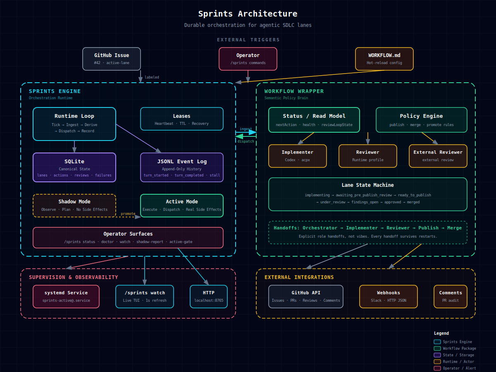
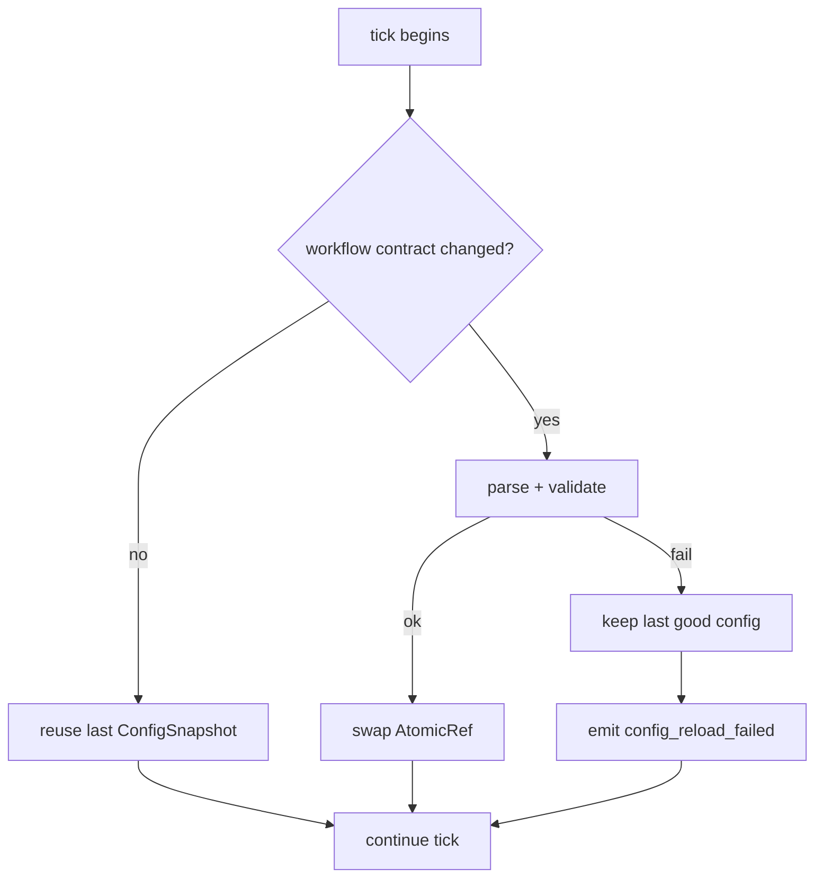

# Sprints Architecture

<div align="center">



> **Sprints is a durable orchestration runtime that runs repo-owned SDLC workflows with leases, persisted state, action/scheduler queues, role handoffs, retries, and operator tooling so agentic work can run continuously without turning into invisible cron-driven chaos.**

</div>

---

## The 30-Second Read

| Question | Answer |
|---|---|
| **What is it?** | A plugin that turns fragile cron-loop automation into explicit, durable 24/7 workflow orchestration. |
| **What problem does it solve?** | Agentic SDLC breaks because policy is buried in prompts, state is scattered, failures are logged but not modeled, and handoffs are implicit. |
| **How?** | Leases. Workflow-specific durable state. JSON/JSONL audit history. Shadow/active execution where supported. Workflow packages with explicit contracts. |
| **Who owns what?** | The **workflow package** decides *what* should happen. **Sprints** decides *how* to orchestrate it durably. |

---

## The Architecture at a Glance

```
┌─────────────────────────────────────────────────────────────────────────────┐
│                         EXTERNAL TRIGGERS                                   │
│   Tracker Issue        Operator (/sprints)    WORKFLOW.md (hot-reload)     │
└─────────────────────────────────────────────────────────────────────────────┘
         │                       │                       │
         ▼                       ▼                       ▼
┌──────────────────────────────────────┐  ┌──────────────────────────────────────┐
│     SPRINTS ENGINE                  │  │    WORKFLOW PACKAGE                  │
│  ─────────────────────────────────   │  │  ─────────────────────────────────   │
│  Runtime Loop                        │  │  Status / Read Model                 │
│    Tick → Ingest → Derive → Dispatch │◄─┤  Policy Engine                       │
│    → Record                          │  │  Roles / Hooks / Gates               │
│                                      │  │  Workflow State Machine              │
│  Leases (heartbeat · TTL · recovery) │  │  Handoffs (explicit, durable)        │
│                                      │  │                                      │
│  Durable State ─► SQLite source       │  │  Semantic Actions                    │
│                 JSON projections     │  │    select_issue                      │
│                                      │  │    render_prompt                     │
│  JSONL ───► turn_started ·           │  │    publish_ready_pr                  │
│             turn_completed · stall   │  │                                      │
│                                      │  │  ▼                                   │
│  Shadow Mode ──► observe · plan      │  │  Execution Actions                   │
│  Active Mode ──► execute · dispatch  │◄─┤    dispatch_turn                     │
│                                      │  │    publish_pr                        │
│  Operator Surfaces                   │  │    merge_pr                          │
│    /sprints status · doctor · watch │  │    run_hooks                         │
│    shadow-report · active-gate       │  │                                      │
└──────────────────────────────────────┘  └──────────────────────────────────────┘
         │                                           │
         ▼                                           ▼
┌────────────────────────────┐              ┌────────────────────────────┐
│  SUPERVISION               │              │  EXTERNAL                  │
│  systemd service           │              │  GitHub API                │
│  /sprints watch (TUI)     │              │  Webhooks (Slack / HTTP)   │
│  HTTP status :8765         │              │  Tracker feedback          │
└────────────────────────────┘              └────────────────────────────┘
```

---

## The Two Brains

Sprints has **two brains** that speak different languages. The boundary between them is the most important design decision in the system.

### Brain 1: The Workflow Package (Semantic)

> *"What should happen next?"*

The workflow package is the **policy engine**. It knows about:
- the tracker and issue model
- workflow-specific states and transitions
- role and prompt structure
- review/publish/merge policy when the workflow has those concepts

It speaks **workflow semantics**:
```
select_issue
render_prompt
publish_ready_pr
merge_and_promote
```

Examples:
- `change-delivery` knows about issue lanes, PRs, reviewer gates, and merge
  policy. Its default production configuration uses GitHub for both `tracker`
  and `code-host`, but those are distinct config boundaries.
- `issue-runner` knows about tracker selection, isolated issue workspaces, lifecycle hooks, and one-agent execution.

### Brain 2: Sprints Runtime (Execution)

> *"How do I orchestrate this durably?"*

Sprints is the **execution engine**. It knows about:
- Leases and heartbeats
- workflow-specific durable state stores
- action queues / scheduler queues and idempotency keys
- Retry bookkeeping and failure tracking
- Shadow vs active execution modes

It speaks **execution semantics**:
```
request_internal_review
publish_pr
merge_pr
dispatch_implementation_turn
dispatch_repair_handoff
```

### Why two vocabularies?

Because **policy changes faster than orchestration**. A workflow package can change its issue lifecycle, gate structure, or prompt strategy. Sprints still has to guarantee that dispatch happens durably, survives crashes, and retries correctly.

---

## The Five Guarantees

Sprints exists to provide five guarantees that fragile cron-loop automation cannot:

### 1. Exactly-One Ownership (Leases)

```
┌─────────┐    acquire lease     ┌─────────┐
│ Runtime │ ───────────────────► │  Lane   │
│    A    │ ◄─────────────────── │  #42    │
└─────────┘    heartbeat (TTL)   └─────────┘
      │
      │  process dies
      ▼
┌─────────┐    lease expires     ┌─────────┐
│ Runtime │ ◄─────────────────── │  Lane   │
│    B    │ ───────────────────► │  #42    │
└─────────┘   claim on next tick └─────────┘
```

- **Exclusivity:** One runtime owns a lane at a time.
- **Liveness:** Heartbeats prove the owner is alive.
- **Recovery:** Any instance can claim an expired lease. No coordinator needed.

### 2. Exactly-Once Actions (Idempotency)

Every active action has a composite key:
```
lane:<id>:<action_type>:<head_sha>
```

This prevents:
- Double-dispatching the same review on the same head
- Re-running `merge_pr` after the PR is already merged
- Spawning infinite implementation actor sessions for a single issue

### 3. State Is Tracked, Not Guessed

| Layer | Storage | Purpose |
|---|---|---|
| **Runtime DB** | `runtime/state/sprints/sprints.db` | Engine work items, running work, retries, runtime sessions, token totals, plus `change-delivery` lanes/actions/reviews/failures |
| **Scheduler JSON** | `memory/workflow-scheduler.json` | Generated operator snapshot of scheduler state for file-oriented tooling |
| **Runtime JSONL** | `runtime/memory/sprints-events.jsonl` | Sprints orchestration events |
| **Workflow JSONL** | `memory/workflow-audit.jsonl` | workflow-specific audit trail |
| **Lane files** | `.lane-state.json` | `change-delivery` lane-local handoff artifacts |
| **Lane memos** | `.lane-memo.md` | human-readable handoff notes |

Never reconstruct current state by replaying events. Current engine execution state is in SQLite; status and scheduler JSON files are projections for operators and file-oriented tools.

### 4. Bad Edits Don't Crash the Loop



A bad `WORKFLOW.md` edit is **ignored**, not fatal. The next valid save picks up automatically.

### 5. Recovery Is Automatic

When an action fails:
1. Failed row is persisted with `retry_count`
2. Next tick checks if retry budget remains
3. If yes: requeue with incremented `retry_count`
4. If no: transition to `operator_attention_required`
5. Human intervenes, or the lane is archived

Lost workers never block forward motion.

---

## Bundled Workflows

Sprints does not ship one universal lifecycle. It ships a generic engine plus
bundled workflow packages.

| Workflow | Shape | Best for | Docs |
|---|---|---|---|
| `change-delivery` | issue -> actor implementation -> gates -> PR -> merge | SDLC automation with code-host gates | [`workflows/change-delivery.md`](workflows/change-delivery.md) |
| `issue-runner` | tracker issue -> workspace -> hooks -> prompt -> one agent run | generic tracker-driven automation | [`workflows/issue-runner.md`](workflows/issue-runner.md) |

The workflow package owns the lifecycle. Sprints owns the durable execution
machinery around it.

That means:
- `change-delivery` can define actors, stages, PR publish, approval gates, and merge gates.
- `issue-runner` can stay smaller and focus on issue selection plus isolated execution.
- both reuse the same workflow contract loader, runtime adapters, hot-reload primitives, and stall detection.

If you are looking for workflow-specific states, prompts, or operator commands,
read the workflow docs rather than treating the generic architecture as if it
described one universal lane state machine.

---

## Execution Modes

### Shadow Mode: "What would I do?"

- Reads workflow state
- Derives next action
- Writes **shadow** action rows (no idempotency check)
- Emits comparison reports
- **No side effects**

Use shadow mode to validate parity safely before promoting to active.

### Active Mode: "What actually happens."

- Reads workflow state
- Derives next action
- Writes **active** action rows (idempotency enforced)
- Dispatches to real runtimes
- Records success / failure / retry state

Promotion from shadow to active is gated by `active-gate-status` — an explicit operator step, not a config edit.

---

## The Data Flow (One Tick)

```
┌─────────────┐     ┌─────────────┐     ┌─────────────┐     ┌─────────────┐
│   TICK      │────►│    LOAD     │────►│   DERIVE    │────►│   DISPATCH  │
│  (cron/     │     │ workflow +  │     │ next step   │     │  to runtime │
│   manual)   │     │ runtime     │     │ from state  │     │  (active)   │
└─────────────┘     └─────────────┘     └─────────────┘     └─────────────┘
                                                                  │
                                                                  ▼
┌─────────────┐     ┌─────────────┐     ┌─────────────┐     ┌─────────────┐
│   NEXT      │◄────│   RECORD    │◄────│   RESULT    │◄────│   RUNTIME   │
│   TICK      │     │  success/   │     │  success/   │     │  executes   │
│             │     │  failure    │     │  failure    │     │  turn       │
└─────────────┘     └─────────────┘     └─────────────┘     └─────────────┘
```

Each tick:
1. **Load** — Read the workflow contract plus the workflow package's current state
2. **Derive** — Ask the workflow package what operation should happen next
3. **Dispatch** — If the derived action is new and its idempotency key is free, dispatch to runtime
4. **Record** — Write result (success/failure/retry) to the workflow's state store plus JSONL audit events
5. **Heartbeat** — Refresh lease to prove liveness

---

## Operator Surfaces

Sprints exposes tooling instead of forcing DB archaeology.

| Surface | Command | What It Answers |
|---|---|---|
| **Status** | `/sprints status` | Runtime row, lane count, paths, freshness |
| **Doctor** | `/sprints doctor` | Full health check across all subsystems |
| **Watch** | `/sprints watch` | Live TUI: lanes + alerts + events |
| **Shadow Report** | `/sprints shadow-report` | Diff shadow plan vs active reality |
| **Active Gate** | `/sprints active-gate-status` | What's blocking promotion to active |
| **Service** | `/sprints service-status` | systemd health snapshot |
| **HTTP** | `GET localhost:8765/api/v1/state` | JSON snapshot for dashboards |

---

## Repository Anatomy

```
sprints/
├── __init__.py              # Plugin registration
├── plugin.yaml              # Plugin manifest
├── schemas.py               # CLI/slash parser schema
├── sprints_cli.py          # Public CLI facade
├── cli/                     # Command implementation + human renderers
├── engine/                  # Stateful SQLite engine, leases, scheduler, events
├── observe/                 # Watch frame rendering + read-only aggregation
├── runtimes/                # Execution backends (Codex, Claude, Hermes)
├── trackers/                # Tracker and code-host clients
└── workflows/
    ├── loader.py            # WORKFLOW.md loader + typed contract
    ├── orchestrator.py      # Gate decision mechanics
    ├── runner.py            # Workflow execution mechanics
    ├── actors.py            # Actor descriptors
    └── actions.py           # Action descriptors
```

---

## Current Deployment Shape

The supported community shape keeps code, policy, and state separated:

| Layer | Owner | Role |
|---|---|---|
| **Plugin** | `~/.hermes/plugins/sprints` | engine, workflow packages, shared runtimes/trackers/code hosts |
| **Repo contract** | `WORKFLOW.md` / `WORKFLOW-<workflow>.md` | workflow policy and operator config |
| **Workflow root** | `~/.hermes/workflows/<owner>-<repo>-<workflow-type>` | durable runtime data and workspace-local state |
| **Sprints service** | systemd user unit | recurring dispatcher/supervisor |
| **Operator surfaces** | Hermes slash/CLI, watch, HTTP | inspection, diagnosis, manual override |

Manual ticks remain useful for debugging, but the service loop is the supported long-running path.

---

## Long-Term Vision

> Full agentic SDLC lanes that run continuously, respect policy and review gates, survive failures, and let humans stay passive by default while stepping in only when judgment or escalation is truly needed.

That means:
- Each lane is durable
- Coding and reviewing are explicit roles
- State transitions are auditable
- Failures are recoverable
- Humans observe or intervene without becoming the scheduler
- The system runs 24/7 without degrading into prompt spaghetti

**Sprints is the control plane for that future.**

---

## See Also

| Doc | What It Covers |
|---|---|
| [`workflows/README.md`](workflows/README.md) | Which bundled workflow to use and where its template lives |
| [`workflows/change-delivery.md`](workflows/change-delivery.md) | The opinionated issue-to-PR SDLC workflow |
| [`workflows/issue-runner.md`](workflows/issue-runner.md) | The generic tracker-driven bundled workflow |
| [`concepts/lanes.md`](concepts/lanes.md) | Lane state machine, selection, workspace binding |
| [`concepts/actions.md`](concepts/actions.md) | Action types, idempotency, shadow vs active |
| [`concepts/failures.md`](concepts/failures.md) | Failure lifecycle, retry policy, lane-220 fixes |
| [`concepts/leases.md`](concepts/leases.md) | Lease acquisition, heartbeat, recovery, split-brain |
| [`concepts/reviewers.md`](concepts/reviewers.md) | Internal/external/advisory review pipeline |
| [`concepts/observability.md`](concepts/observability.md) | Watch TUI, HTTP server, tracker feedback |
| [`concepts/operator-attention.md`](concepts/operator-attention.md) | When attention triggers, thresholds, recovery |
| [`operator/cheat-sheet.md`](operator/cheat-sheet.md) | Day-to-day commands, debugging, SQL cheats |

---

## Architecture in One Sentence

**Sprints is a durable orchestration runtime that runs repo-owned SDLC workflows with leases, persisted state, action/scheduler queues, role handoffs, retries, and operator tooling so agentic work can run continuously without turning into invisible cron-driven chaos.**
